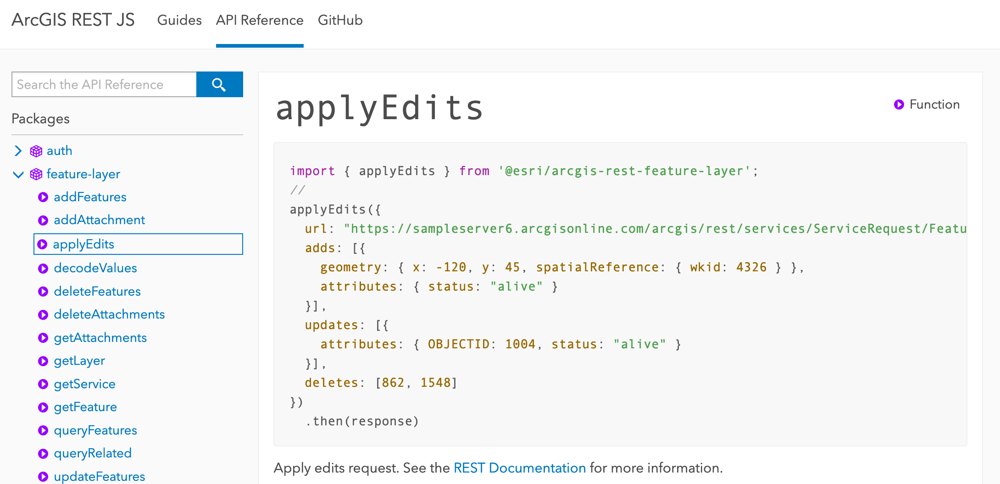

<!-- .slide: data-background="../node_modules/esri-reveal.js-templates/img/2020/fed/bg-1.png" data-background-size="cover" style="padding-left: 80px;" -->

  <h1 style="text-align: left; font-size: 80px;">Presentation Title</h1>
  
Tom Wayson

  
<a href="https://github.com/tomwayson">@tomwayson</a>

  <!-- TODO: shorten URL -->
  
slides: <a href="https://tomwayson.github.io/fed-gis-2020-web-editing-with-the-js-api/slides/#/"><code>https://tomwayson.github.io/fed-gis-2020-web-editing-with-the-js-api/slides/#/</code></a>

  
  <!-- Add these rows to push your text up so it is not interfering with the event name. Test on your actual projector! -->
  
&nbsp;
 
  
&nbsp;

  <!-- /end spacer rows -->

---

<!-- .slide: data-background="../node_modules/esri-reveal.js-templates/img/2020/fed/bg-3.png" data-background-size="cover" -->

## Agenda

* Web editing
* Editor widget
* Custom workflows
* Q&A

---

<!-- .slide: data-background="../node_modules/esri-reveal.js-templates/img/2020/fed/bg-2.png" data-background-size="cover" -->

## Data in a [Feature Service](https://developers.arcgis.com/rest/services-reference/feature-service.htm)

* One or more feature layers
* Editable
* Set permissions and constraints

---

<!-- .slide: data-background="../node_modules/esri-reveal.js-templates/img/2020/fed/bg-2.png" data-background-size="cover" -->

## Edit feature layers on the web

<ul style="display: grid; grid-template-columns: 50% 50%; grid-column-gap: 10px; margin: 0 20%; list-style: none; text-align: center;">
  <li>ArcGIS Online</li>
  <li>ArcGIS for Developers</li>
  <li>ArcGIS API for JavaScript</li>
  <li>ArcGIS REST JS</li>
</ul>

<u>[ArcGIS REST API](https://developers.arcgis.com/rest/)</u>

---

<!-- .slide: data-background="../node_modules/esri-reveal.js-templates/img/2020/fed/bg-2.png" data-background-size="cover" -->

## ArcGIS API for JavaScript

Configurable widgets

Granular APIs

---

<!-- .slide: data-background="../node_modules/esri-reveal.js-templates/img/2020/fed/bg-2.png" data-background-size="cover" -->

## Confgiurable Widgets

* [Editor](https://developers.arcgis.com/javascript/latest/api-reference/esri-widgets-Editor.html)
  * Geometry: [Sketch](http://developers.arcgis.com/javascript/latest/api-reference/esri-widgets-Sketch.html)
  * Fields/attributes: [FeatureForm](http://developers.arcgis.com/javascript/latest/api-reference/esri-widgets-FeatureForm.html)
  * [FeatureTemplates](http://developers.arcgis.com/javascript/latest/api-reference/esri-widgets-FeatureTemplates.html)

---

<!-- .slide: data-background="../node_modules/esri-reveal.js-templates/img/2020/fed/bg-2.png" data-background-size="cover" -->

## Granular APIs

* [GraphicsLayer](https://developers.arcgis.com/javascript/latest/api-reference/esri-layers-GraphicsLayer.html)
* [FeatureLayer.applyEdits](http://developers.arcgis.com/javascript/latest/api-reference/esri-layers-FeatureLayer.html#applyEdits)
* [geometryEngine](https://developers.arcgis.com/javascript/latest/api-reference/esri-geometry-geometryEngine.html)

---

<!-- .slide: data-background="../node_modules/esri-reveal.js-templates/img/2020/fed/bg-4.png" data-background-size="cover" -->

## [Editor](https://developers.arcgis.com/javascript/latest/api-reference/esri-widgets-Editor.html) widget

**Since v4.11** 🚀

---

<!-- .slide: data-background="../node_modules/esri-reveal.js-templates/img/2020/fed/bg-4.png" data-background-size="cover" -->

## Custom Workflows

---

<!-- .slide: data-background="../node_modules/esri-reveal.js-templates/img/2020/fed/bg-3.png" data-background-size="cover" -->

## Form-based

☝ `FeatureForm`

---

## [`FeatureForm`](https://developers.arcgis.com/javascript/latest/api-reference/esri-widgets-FeatureForm.html)

* Renders input fields from fields & attributes<!-- .element: class="fragment" data-fragment-index="1" -->
* Configurable<!-- .element: class="fragment" data-fragment-index="2" -->
  * Field order
  * Label/description
  * Groups
  * Visibility expression

---

## `FeatureForm` Demo

---

## Advanced `FeatureForm` Demo

---

## ArcGIS REST JS

---

## [@esri/arcgis-rest-feature-layer](https://esri.github.io/arcgis-rest-js/api/feature-layer/)

* Use when your app doesn't have a map
* Bring your own UI (i.e. framework / library)

---

<!-- .slide: data-background="../node_modules/esri-reveal.js-templates/img/2020/fed/bg-3.png" data-background-size="cover" -->

## Geometry-based

☝ `Sketch`

---

## [`Sketch`](https://developers.arcgis.com/javascript/latest/api-reference/esri-widgets-Sketch.html)

* Provides ability to manipulate geometries<!-- .element: class="fragment" data-fragment-index="1" -->
* Configurable<!-- .element: class="fragment" data-fragment-index="2" -->
  * Tool options (create and update)
  * Internal view listener for activating update workflow

---

<!-- .slide: data-background="../node_modules/esri-reveal.js-templates/img/2020/fed/bg-4.png" data-background-size="cover" -->

## Geometry-based Demos

* [Sketch](https://developers.arcgis.com/javascript/latest/sample-code/sketch-geometries/index.html)
* SketchViewModel with applyEdits
* Sketch with applyEdits
* Sketch with custom tools
* Sketch with custom snapping and validation

<!-- add screenshot for geometry-based demo -->

---

<!-- .slide: data-background="../node_modules/esri-reveal.js-templates/img/2020/fed/bg-4.png" data-background-size="cover" -->

## Recap

* Set constraints at the service level
* ArcGIS API for JavaScript
  * Editor widget
  * Custom workflows
* ArcGIS REST JS
  * Already have a framework, no map

---

## Additional Resources

- [JavaScript API SDK](https://developers.arcgis.com/javascript/)
- [Arcade - expression language](https://developers.arcgis.com/javascript/latest/guide/arcade/index.html)
- [ArcGIS REST JS](https://esri.github.io/arcgis-rest-js/)

---

<!-- SURVEY SLIDE: -->
<section data-markdown data-background="../node_modules/esri-reveal.js-templates/img/2020/fed/bg-rating.png">
</section>

---

## Questions?

##### For example

> 🤔 Where can I find the slides/source?

<!-- TODO: shorten URL -->
👉 [@tomwayson/fed-gis-2020-web-editing-with-the-js-api](https://github.com/tomwayson/fed-gis-2020-web-editing-with-the-js-api) 👈
