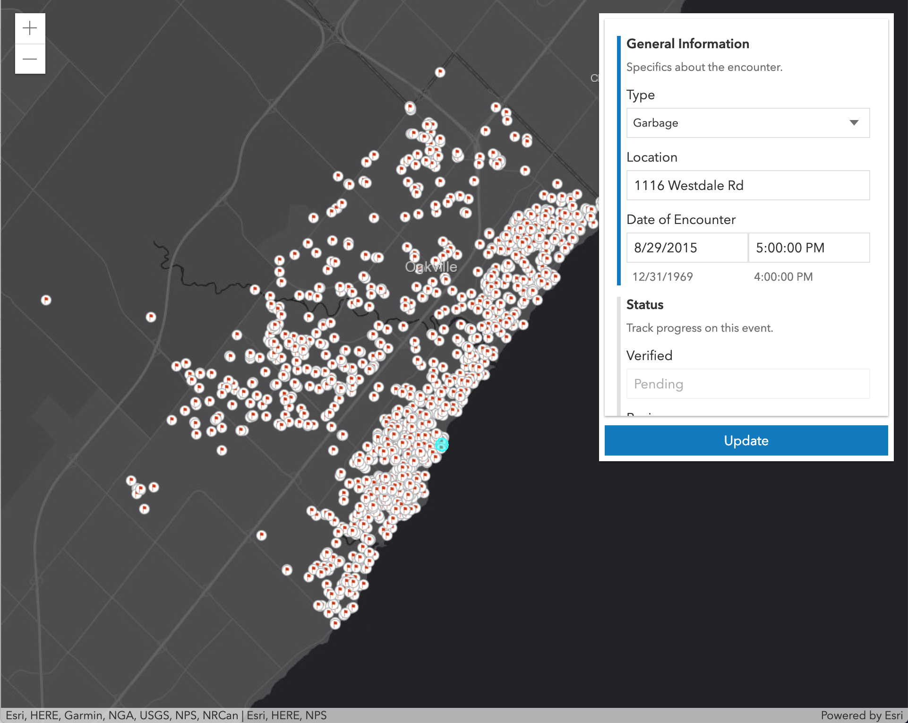

<!-- .slide: data-background="../node_modules/esri-reveal.js-templates/img/2019/devsummit/bg-1.png" data-background-size="cover" -->

# Web Editing with the ArcGIS API for JavaScript

#### Bjorn Svensson
#### Jonathan Uihlein
#### JC Franco

---

<!-- .slide: data-background="../node_modules/esri-reveal.js-templates/img/2019/devsummit/bg-3.png" data-background-size="cover" -->

## Agenda

* Background
* OOB Editing
* Custom workflows
* Q&A

---

<!-- .slide: data-background="../node_modules/esri-reveal.js-templates/img/2019/devsummit/bg-2.png" data-background-size="cover" -->

## Data in a feature servive

* One or more feature layers
* Editable

---

<!-- .slide: data-background="../node_modules/esri-reveal.js-templates/img/2019/devsummit/bg-2.png" data-background-size="cover" -->

## Edit your feature layer

<u>ArcGIS REST API</u>

ArcGIS Online

ArcGIS API for Python

ArcGIS API for JavaScript

---

<!-- .slide: data-background="../node_modules/esri-reveal.js-templates/img/2019/devsummit/bg-2.png" data-background-size="cover" -->

## Web editing in the browser

1. What to add: [FeatureTemplates](http://developers.arcgis.com/javascript/latest/api-reference/esri-widgets-FeatureTemplates.html)
2. Geometry: [Sketch](http://developers.arcgis.com/javascript/latest/api-reference/esri-widgets-Sketch.html)
3. Fields/attributes: [FeatureForm](http://developers.arcgis.com/javascript/latest/api-reference/esri-widgets-FeatureForm.html)
4. [FeatureLayer.applyEdits](http://developers.arcgis.com/javascript/latest/api-reference/esri-layers-FeatureLayer.html#applyEdits)

5. Editor widget

---

<!-- .slide: data-background="../node_modules/esri-reveal.js-templates/img/2019/devsummit/bg-4.png" data-background-size="cover" -->

## Editor widget

✨**New in 4.11**✨

---

<!-- .slide: data-background="../node_modules/esri-reveal.js-templates/img/2019/devsummit/bg-4.png" data-background-size="cover" -->

# Custom Workflows

---

<!-- .slide: data-background="../node_modules/esri-reveal.js-templates/img/2019/devsummit/bg-3.png" data-background-size="cover" -->

# Geometry-based

☝ `Sketch`

---

<!-- .slide: data-background="../node_modules/esri-reveal.js-templates/img/2019/devsummit/bg-4.png" data-background-size="cover" -->

## Geometry-based

* Demo

<!-- add screenshot for geometry-based demo -->

---

<!-- .slide: data-background="../node_modules/esri-reveal.js-templates/img/2019/devsummit/bg-5.png" data-background-size="cover" -->

## Form-based

☝ `FeatureForm`

---

## [`FeatureForm`](https://developers.arcgis.com/javascript/latest/api-reference/esri-widgets-FeatureForm.html)

* Renders input fields from attributes<!-- .element: class="fragment" data-fragment-index="1" -->
* Configurable<!-- .element: class="fragment" data-fragment-index="2" -->
  * Field order
  * Label/description
  * Groups 
  * Visibility expression (✨New in 4.11✨)

---

## `FeatureForm` Demo 

---

## `FeatureForm` Recap 

---

<!-- .slide: data-background="../node_modules/esri-reveal.js-templates/img/2019/devsummit/bg-6.png" data-background-size="cover" -->

## Recap

* Background
* OOB Editing
* Custom workflows 

---

<!-- SURVEY SLIDE: -->
<section data-markdown data-background="../node_modules/esri-reveal.js-templates/img/2019/devsummit/bg-rating.png">

---

## Questions?

##### For example

> 🤔 Where can I find the slides/source?

👉 [bit.ly/webeditingds19](http://bit.ly/webeditingds19) 👈

---

<!-- .slide: data-background="../node_modules/esri-reveal.js-templates/img/2019/devsummit/bg-esri.png" data-background-size="cover" -->
