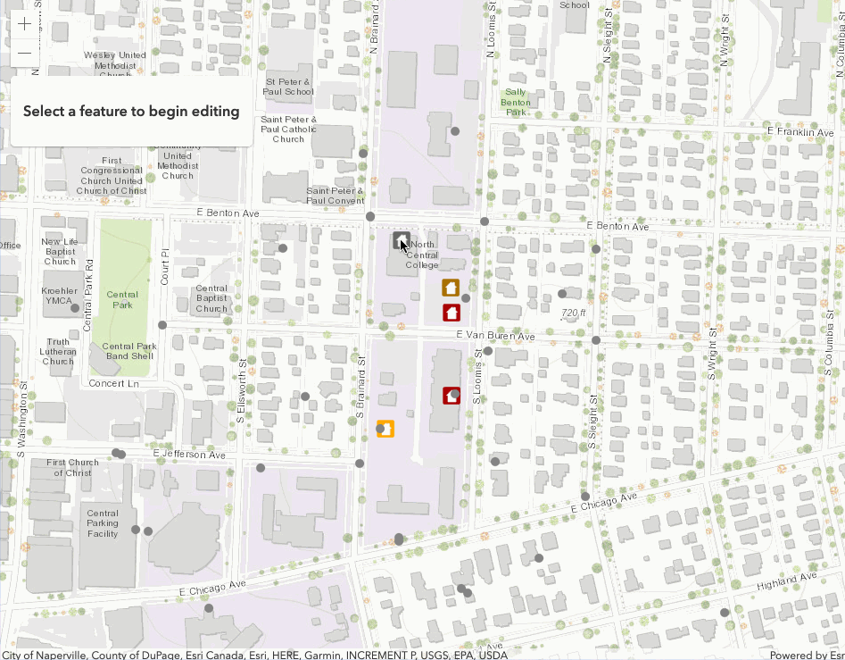

<!-- .slide: data-background="../node_modules/esri-reveal.js-templates/img/2019/devsummit/bg-1.png" data-background-size="cover" -->

# Web Editing with the ArcGIS API for JavaScript

### Bjorn Svensson
### Jonathan Uihlein
### JC Franco

---

<!-- .slide: data-background="../node_modules/esri-reveal.js-templates/img/2019/devsummit/bg-3.png" data-background-size="cover" -->

## Agenda

* Background
* OOB Editing
* Custom workflows
* Q&A

---

<!-- .slide: data-background="../node_modules/esri-reveal.js-templates/img/2019/devsummit/bg-2.png" data-background-size="cover" -->

## Data in a feature servive

* one or more feature layers
* editable

---

<!-- .slide: data-background="../node_modules/esri-reveal.js-templates/img/2019/devsummit/bg-2.png" data-background-size="cover" -->

## Edit your feature layer

<u>ArcGIS REST API</u>

ArcGIS Online

ArcGIS API for Python

ArcGIS API for JavaScript

---

<!-- .slide: data-background="../node_modules/esri-reveal.js-templates/img/2019/devsummit/bg-2.png" data-background-size="cover" -->

## Web editing in the browser

1. what to add: [FeatureTemplates](http://developers.arcgis.com/javascript/latest/api-reference/esri-widgets-FeatureTemplates.html)
2. geometry: [Sketch](http://developers.arcgis.com/javascript/latest/api-reference/esri-widgets-FeatureTemplates.html)
3. fields/attributes: [FeatureTemplates](http://developers.arcgis.com/javascript/latest/api-reference/esri-widgets-FeatureTemplates.html)
4. [FeatureLayer.applyEdit](http://developers.arcgis.com/javascript/latest/api-reference/esri-layers-FeatureLayer.html#applyEdits)

5. Editor widget

---

<!-- .slide: data-background="../node_modules/esri-reveal.js-templates/img/2019/devsummit/bg-4.png" data-background-size="cover" -->

## Editor widget

✨**New in 4.11**✨

---

<!-- .slide: data-background="../node_modules/esri-reveal.js-templates/img/2019/devsummit/bg-4.png" data-background-size="cover" -->

# Custom Workflows

---

<!-- .slide: data-background="../node_modules/esri-reveal.js-templates/img/2019/devsummit/bg-3.png" data-background-size="cover" -->

# Geometry-based

☝ `Sketch`

---

<!-- .slide: data-background="../node_modules/esri-reveal.js-templates/img/2019/devsummit/bg-4.png" data-background-size="cover" -->

## Geometry-based

* Demo

<!-- add screenshot for geometry-based demo -->

---

<!-- .slide: data-background="../node_modules/esri-reveal.js-templates/img/2019/devsummit/bg-5.png" data-background-size="cover" -->

## Form-based

☝ `FeatureForm`

---

## `FeatureForm`

* Renders input fields from attributes<!-- .element: class="fragment" data-fragment-index="1" --> 
* Configurable<!-- .element: class="fragment" data-fragment-index="2" -->
  * Groups <!-- .element: class="fragment" data-fragment-index="2" -->
  * Visibility expression (✨New in 4.11✨) <!-- .element: class="fragment" data-fragment-index="2" -->

---

<!-- .slide: data-background="../node_modules/esri-reveal.js-templates/img/2019/devsummit/bg-4.png" data-background-size="cover" -->

## Form-based

* Demo

<!-- add screenshot for form-based demo -->

---

<!-- .slide: data-background="../node_modules/esri-reveal.js-templates/img/2019/devsummit/bg-6.png" data-background-size="cover" -->

## Recap

* Background
* OOB Editing
* Custom workflows 

---

<!-- SURVEY SLIDE: -->
<section data-markdown data-background="../node_modules/esri-reveal.js-templates/img/2019/devsummit/bg-rating.png">

---

## Questions?

##### For example

> 🤔 Where can I find the slides/source?

👉 [bit.ly/webeditingds19](http://bit.ly/webeditingds19) 👈

---

<!-- .slide: data-background="../node_modules/esri-reveal.js-templates/img/2019/devsummit/bg-esri.png" data-background-size="cover" -->
